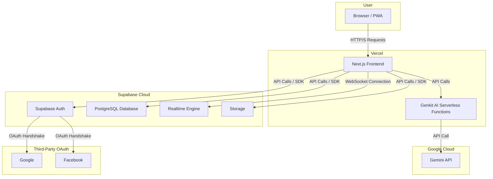
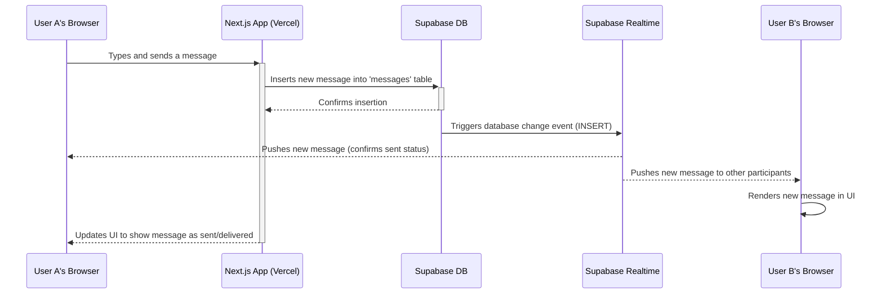

# Project Synopsis: Krishna Connect

---

### **1. Title**
**Krishna Connect: Where Devotees Unite**

---

### **2. Introduction / Background**
In an increasingly digital world, spiritual communities seek dedicated spaces to foster connection, share wisdom, and organize activities. Krishna Connect is a modern, real-time chat application designed to serve this need for the conscious community of Krishna devotees. It aims to provide a secure, feature-rich, and spiritually uplifting alternative to mainstream messaging platforms, which are often filled with distractions.

The project was undertaken to create a sacred digital *satsang* (spiritual gathering) where members can engage in meaningful conversations, coordinate *seva* (selfless service), and deepen their collective spiritual journey, free from the noise of commercial social media.

---

### **3. Objectives**
The primary objectives of Krishna Connect are:
- **To Foster Community:** Create a centralized platform for devotees to connect, communicate, and build strong, supportive relationships.
- **To Facilitate Communication:** Provide robust real-time messaging features, including one-on-one DMs, group chats (Circles), and channels for announcements.
- **To Enhance User Experience:** Deliver a beautiful, intuitive, and highly performant user interface that is both a joy to use and customizable to individual preferences.
- **To Ensure a Safe & Sacred Space:** Implement features like moderated DM requests, user reporting, and admin controls to maintain a respectful and secure environment.
- **To Support Community Activities:** Integrate features for organizing and managing events, from online lectures to local meetups.
- **To Be Extensible:** Build upon a modern, scalable tech stack that allows for future feature development and community growth, including Generative AI enhancements.

---

### **4. Scope**
The scope of the project defines its boundaries, outlining what is included and what is intentionally excluded.

#### **In-Scope:**
- **User Authentication:** Secure sign-up, login (email/password & OAuth), and profile management.
- **Real-Time Messaging:** One-on-one and group chats with typing indicators, read receipts, and online status.
- **Rich Media:** Sharing of images, documents, and voice notes.
- **Message Interactions:** Reactions, replies, editing, deleting, forwarding, and starring messages.
- **Advanced Features:** Text formatting, link previews, `@mentions`, and pinned messages.
- **Customization:** Light/dark modes and customizable chat appearance (bubble colors, wallpapers).
- **Community Management:** Admin panel for user management, DM request moderation, and group administration.
- **Event System:** Creation, RSVP, and sharing of community events.
- **AI Features:** Integration of Genkit for potential future AI-powered enhancements.

#### **Out-of-Scope (for the current version):**
- **Live Video/Audio Calls:** While planned for the future, real-time video/audio calling is not part of the initial scope.
- **E-commerce or Donations:** The platform will not handle financial transactions.
- **Advanced Social Media Feeds:** The focus is on direct and group communication, not on public, algorithm-driven feeds.
- **Native Mobile Applications:** The initial product is a responsive Progressive Web App (PWA). Native iOS/Android apps are a future consideration.

---

### **5. Methodology / Approach**
The project follows an **Agile development methodology**, characterized by iterative development cycles.
1.  **Requirement Gathering:** Features are defined based on the core needs of a spiritual community and inspired by best practices from modern chat applications.
2.  **Design & Prototyping:** User interface and experience are designed using a component-based approach with ShadCN UI and Figma mockups.
3.  **Development Sprints:** Development is broken down into small, manageable tasks. The front end (Next.js) and back end (Supabase, Genkit) are developed in parallel.
4.  **Database-First Approach:** The database schema is designed first in Supabase, with security rules (RLS) being a primary consideration.
5.  **Testing & QA:** Manual testing is performed at the end of each feature implementation to ensure functionality and identify bugs.
6.  **Deployment:** The application is deployed on Vercel, leveraging its seamless integration with Next.js and serverless functions.
7.  **Feedback & Iteration:** Post-launch, user feedback will be collected to guide future development cycles.

---

### **6. Tools & Technologies Used**
- **Framework:** **Next.js 14** (App Router)
- **AI Toolkit:** **Genkit** (for Generative AI)
- **UI Library:** **React 18**
- **UI Components:** **ShadCN UI**
- **Styling:** **Tailwind CSS**
- **Backend & Database:** **Supabase** (PostgreSQL, Auth, Storage, Realtime)
- **Language:** **TypeScript**
- **Deployment:** **Vercel**
- **Package Management:** **npm**
- **Version Control:** **Git & GitHub**

---

### **7. System Architecture & Data Flow**

#### **High-Level Architecture Diagram**
This diagram illustrates the main components of the system and their interactions.

#### **Chat Message Data Flow Diagram**
This diagram shows the sequence of events when a user sends a message.

---

### **8. Database Schema**
*(The database schema is defined in the `supabase/schema.sql` file in the project repository.)*

---

### **9. Expected Outcomes**
Upon completion, the project will deliver:
- **A Fully Functional Web Application:** A responsive and performant chat application accessible from any modern web browser.
- **Secure & Scalable Backend:** A complete backend system powered by Supabase, capable of handling authentication, data storage, and real-time communication for a growing user base.
- **Comprehensive Feature Set:** All features listed in the "In-Scope" section will be implemented and functional.
- **Intuitive Admin Panel:** A dedicated interface for administrators to manage the community effectively.
- **Project Documentation:** Well-documented code, a detailed README, and this synopsis to facilitate maintenance and future development.

---

### **10. Timeline (High-Level Phases)**
- **Phase 1: Foundation & Core Chat (Completed)**
  - Setup of Next.js project, Supabase, and Vercel.
  - Implementation of user authentication and profiles.
  - Development of core real-time messaging (DMs and groups).
- **Phase 2: Feature Enhancement (Completed)**
  - Addition of rich media (images, files, voice notes).
  - Implementation of message replies, reactions, editing, and deleting.
  - UI/UX improvements, including theme customization.
- **Phase 3: Community & Moderation (Completed)**
  - Development of the Events system.
  - Creation of the Admin Panel for user and DM request management.
  - Implementation of user blocking and reporting systems.
- **Phase 4: AI & Final Polish (In Progress)**
  - Integration of Genkit for AI features.
  - Performance optimization and bug fixing.
- **Phase 5: Future Growth (Future)**
  - Exploration of native mobile app development.
  - Integration of real-time audio/video calls.

---

### **11. Conclusion**
Krishna Connect is more than a software project; it is a digital tool for community building and spiritual nourishment. By leveraging modern web technologies, it provides a tailored, safe, and engaging environment that meets the unique needs of the devotee community. Its successful implementation will offer a valuable resource that strengthens bonds, facilitates collaboration, and supports the shared spiritual path of its members.
